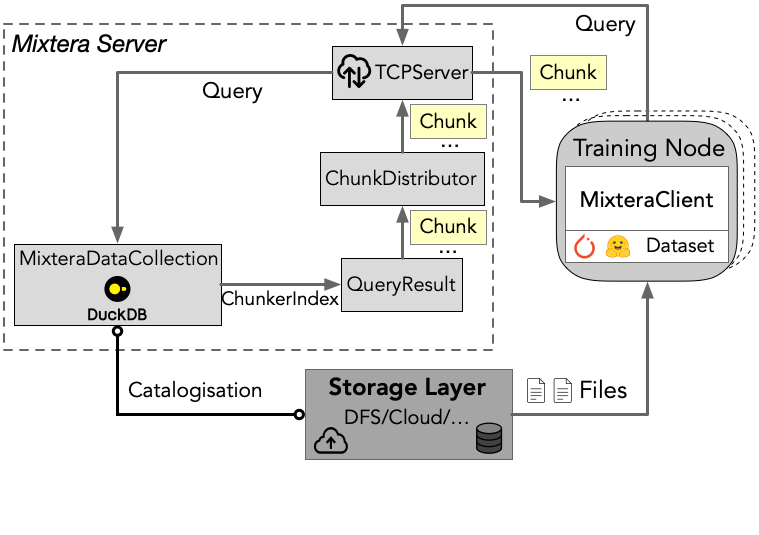

<div align="center">
<h1>Mixtera</h1>

---
[](https://github.com/eth-easl/mixtera/actions/workflows/workflow.yaml)
[](https://img.shields.io/github/license/eth-easl/mixtera)

Mixtera is an open-source data-centric training data plane built for modern LLM/VLM training. It enables ML engineers to declaratively filter, mix, and distribute large-scale training datasets on the fly, while supporting dynamic adjustment based on model feedback. Learn more in our [paper](https://mboether.com/assets/pdf/bother2024mixtera.pdf).

</div>

## ⚡️ Quickstart

Mixtera can run as a server (as presented in the paper) or, for single-GPU training, in-process. In both cases, you will need to install the necessary dependencies and install Mixtera in your environment, for example as follows:

```bash
# In case you don't have micromamba yet
# macos:
brew install micromamba
# alternatively:
"${SHELL}" <(curl -L micro.mamba.pm/install.sh)

# Start here if you have micromamba already
micromamba env create -f ./environment.yml
micromamba activate mixtera
pip install -e .
pip install -r dev-requirements.txt
```

## 🔁 What is Mixtera used for?
Modern large language and vision models rely on training datasets with fine-grained properties such as language, source, topic, or license. Traditionally, ML engineers have managed these datasets manually using ad hoc scripts and directory structures, which is time-consuming, tedious, and prone to errors. Mixtera addresses these issues by providing a lightweight, declarative data plane that lets you seamlessly filter and dynamically mix data on the fly without the overhead of redundant data processing.

Whether you need to enforce fixed data ratios—say, 70% JavaScript code and 30% Python, or want to adjust proportions during training using feedback-driven algorithms like [ADO](https://arxiv.org/abs/2410.11820), Mixtera offers a flexible interface for both static and dynamic mixing. Beyond efficiency, Mixtera ensures that distributed training jobs receive identical, reproducible data inputs across all nodes, crucial for consistency and accurate model results.

Mixtera is a centralized sample management layer, building upon DuckDB. It abstracts away the complexities of file-system-based data management. It supports data samples stored in various formats (e.g., jsonl, parquet, webdataset), letting users focus on model research rather than data wrangling.

## ✨ Mixtera’s System Overview




## ✉️ About

Mixtera is being developed at the [Efficient Architectures and Systems Lab (EASL)](https://anakli.inf.ethz.ch/#Group) at the [ETH Zurich Systems Group](https://systems.ethz.ch/).
Please reach out to `mboether [at] inf [­dot] ethz [dot] ch` or open an issue on Github if you have any questions or inquiry related to Mixtera and its usage.
