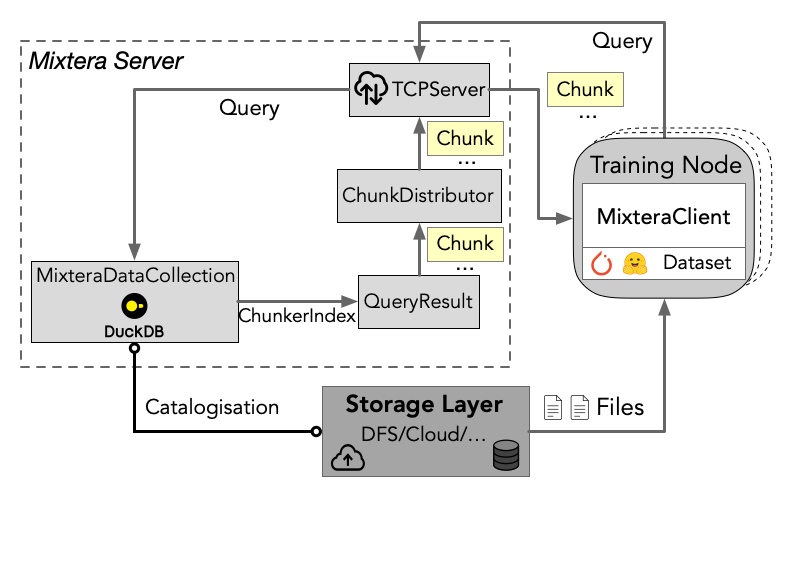

<div align="center">
<h1>Mixtera</h1>

---
[](https://github.com/eth-easl/mixtera/actions/workflows/workflow.yaml)
[](https://img.shields.io/github/license/eth-easl/mixtera)

Mixtera is an open-source data-centric training data plane built for modern LLM/VLM training. It enables ML engineers to declaratively filter, mix, and distribute large-scale training datasets on the fly, while supporting dynamic adjustment based on model feedback. Learn more in our [paper](https://arxiv.org/abs/2502.19790).

</div>

## ⚡️ Quickstart

Mixtera can run as a server, or, for single-GPU training, in-process. In both cases, you can install Mixtera simply using pip:

```bash
# In case you don't have a Python environment yet
# instead of micromamba, you might also consider pixi
"${SHELL}" <(curl -L micro.mamba.pm/install.sh)

# Start here if you have Python already set up
pip install git+https://github.com/eth-easl/mixtera[torch,dev]
```

If you do not want to have pytorch in your environment, you can remove the optional `torch` flag.
Similarily, you might want to disable the `dev` flag if you do not want to modify Mixtera. 
After this installation, the Mixtera server can then be started using the `mixtera-server` command.

## 🔁 What is Mixtera used for?
Modern large language and vision models rely on training datasets with fine-grained properties such as language, source, topic, or license. Traditionally, ML engineers have managed these datasets manually using ad hoc scripts and directory structures, which is time-consuming, tedious, and prone to errors. Mixtera addresses these issues by providing a lightweight, declarative data plane that lets you seamlessly filter and dynamically mix data on the fly without the overhead of redundant data processing.

Whether you need to enforce fixed data ratios—say, 70% JavaScript code and 30% Python, or want to adjust proportions during training using feedback-driven algorithms like [ADO](https://arxiv.org/abs/2410.11820), Mixtera offers a flexible interface for both static and dynamic mixing. Beyond efficiency, Mixtera ensures that distributed training jobs receive identical, reproducible data inputs across all nodes, crucial for consistency and accurate model results.

Mixtera is a centralized sample management layer, building upon DuckDB. It abstracts away the complexities of file-system-based data management. It supports data samples stored in various formats (e.g., jsonl, parquet, webdataset), letting users focus on model research rather than data wrangling.

## 🚀 Usage

Using Mixtera typically consists of (1) registering your data and (2) running queries/trainings on top of it. We maintain several [examples](https://github.com/eth-easl/mixtera/blob/main/examples/) of how to use Mixtera. A good first read is the [local-only example](https://github.com/eth-easl/mixtera/blob/main/examples/client_local_example.py). That script walks you through the basics of registering data in Mixtera and running a query on that. Afterwards, the [server example](https://github.com/eth-easl/mixtera/blob/main/examples/client_server_example.py) shows you how to run a server with the `mixtera-server` command, and how to register data and query it via client-server interaction.

We provide a [full guide](examples/torchtitan.md) on how to run a training with Mixtera and torchtitan, in particular on how to run the server, register the dataset, and then start training jobs, for both bare-metal and slurm (e.g., SwissAI/CSCS/Alps/Clariden) deployments.

## ✨ Mixtera’s System Overview

<div align="center">

</div>

Mixtera follows a server-client model. During training, the server runs on a node and each training node runs client instances. The query is executed at the server in two phases. First, Mixtera applies static filters from the query (e.g., English-only) to obtain all samples we could train on. This gives us a [QueryResult](https://github.com/eth-easl/mixtera/blob/main/mixtera/core/query/query_result.py). Second, during training, the server distributes [chunks](https://github.com/eth-easl/mixtera/blob/main/mixtera/core/query/result_chunk.py) of that query result to the client(s). A chunk is a collection of pointers to samples in files. These pointers tell the receiving client which samples in the file to load (e.g., sample 10 in file `wikipedia.jsonl.zst`).

## ✉️ About

Mixtera is being developed at the [Efficient Architectures and Systems Lab (EASL)](https://anakli.inf.ethz.ch/#Group) at the [ETH Zurich Systems Group](https://systems.ethz.ch/).
Please reach out to `mboether [at] inf [­dot] ethz [dot] ch` or open an issue on Github if you have any questions or inquiry related to Mixtera and its usage.
