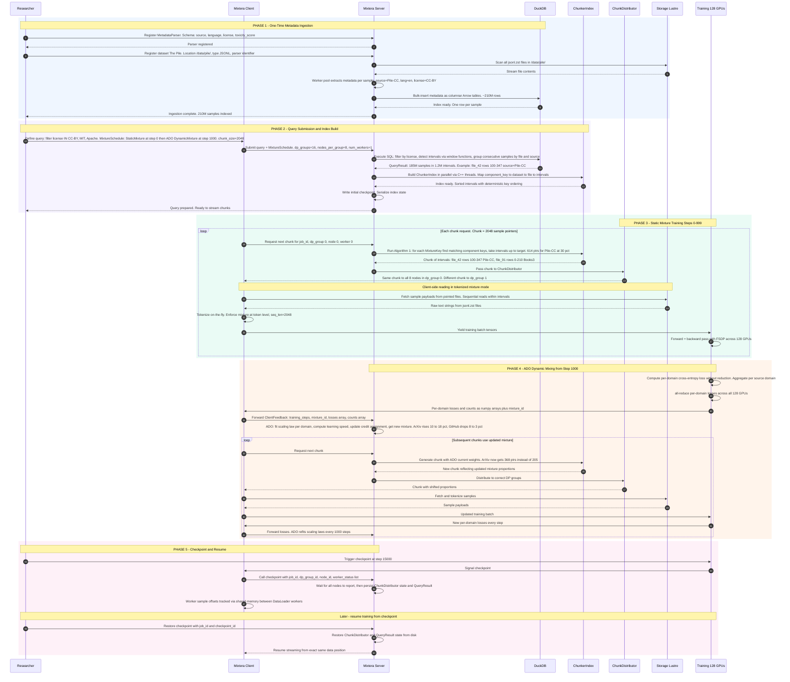

# Mixtera: From Mixture Specification to GPU-Ready Batches

A representative end-to-end workflow showing how a researcher declaratively specifies a multi-property training data mixture and how Mixtera's components coordinate to serve chunks to a distributed training job.

---

## Scenario: Pre-training a 3.6B Llama on The Pile

A researcher is pre-training a 3.6B-parameter Llama model on **The Pile** (~800 GB, 22 domains). They want to:

1. **Static filter** — Use only permissively-licensed data (CC-BY, MIT, Apache)
2. **Dynamic mix** — Start with a hand-crafted static mixture, then switch to ADO (dynamic) at step 1,000
3. **Distributed** — Train on 128 GPUs (32 nodes x 4 GPUs, 16 DP groups of 8)

The training objective is standard causal language modeling with next-token cross-entropy:

$$
\mathcal{L}_{\text{LM}} = -\frac{1}{N}\sum_{i=1}^{N}\log p_{\theta}(x_i \mid x_{<i})
$$

where $x_i$ is the target token at position $i$, $x_{<i}$ is its left context, and $N$ is the number of non-padding tokens in the batch.

Intuition: each token contributes $-\log p_{\theta}(x_i \mid x_{<i})$. If the model assigns high probability to the true next token, the penalty is small; if it assigns low probability, the penalty is large.

Example (close prediction): context = "The capital of France is", true next token = "Paris". If the model predicts $p(\text{"Paris"})=0.80$, the token loss is $-\log(0.80)\approx 0.22$.

Example (far prediction): same context and target, but the model assigns $p(\text{"Paris"})=0.01$ because it puts mass on unrelated tokens. Then the token loss is $-\log(0.01)\approx 4.61$, much larger. This is why cross-entropy strongly penalizes confident mistakes and rewards probability mass on the correct next token.

During ADO, the cross-entropy loss is computed *without reduction*, producing a loss value for every token in the batch. Because the tokenized mixture mode tracks which domain each token belongs to, those per-token losses are aggregated into a single loss value per domain (e.g., one for Pile-CC, one for ArXiv, one for Books3) and all-reduced across GPUs so every node agrees on the same numbers. The Mixtera server collects these per-domain losses every training step and periodically re-fits a power-law scaling curve $\hat{L}_k(n) = \varepsilon_k + \beta_k \, n^{-\alpha_k}$ for each domain $k$, capturing how that domain's loss decreases as a function of samples seen. ADO then derives two signals from the fitted curves — the *learning speed* (how fast each domain's loss is currently dropping) and a *credit-assignment score* (how much of that improvement comes from training on the domain's own data versus cross-domain transfer) — and combines them to produce updated mixture weights $\pi_k(t)$ that are applied the next time the server generates a chunk.

The initial static mixture (before ADO takes over):

| MixtureKey (source domain) | Target % | Example samples |
|---|---|---|
| Pile-CC (Common Crawl) | **30%** | web pages, blogs, news articles |
| Books3 | **20%** | fiction and non-fiction books |
| OpenWebText2 | **15%** | curated high-quality web text |
| PubMed Central | **12%** | biomedical journal articles |
| ArXiv | **10%** | scientific pre-prints (LaTeX) |
| GitHub | **8%** | source code repositories |
| Wikipedia (en) | **5%** | encyclopedia articles |

---

## Sequence Diagram

One-time ingestion, query and chunk generation, distributed training loop with dynamic ADO feedback.

| Phase | Color | Description |
|---|---|---|
| Phase 1 | Blue | One-time metadata ingestion into DuckDB |
| Phase 2 | Purple | Query submission, SQL execution, ChunkerIndex build |
| Phase 3 | Green | Static mixture training loop (steps 0–999) |
| Phase 4 | Orange | ADO dynamic mixing with per-domain loss feedback |
| Phase 5 | Pink | Checkpoint and resume from saved state |

| # | Component | Part of Mixtera? | Description |
|---|---|---|---|
| 1 | **Mixtera Client** | Yes | A Python library that runs on the CPU side of each training node, installed as a dependency of the training job. It requests chunks from the server over TCP, fetches sample payloads directly from storage, tokenizes them on the fly, and yields batch tensors to the training loop via a `torch.DataLoader`-compatible interface. |
| 2 | **Mixtera Server** | Yes | Centralized process that ingests sample metadata, executes declarative queries, generates mixture-aware chunks of sample pointers, and coordinates their distribution to training nodes. |
| 3 | **DuckDB** | External dependency | Embedded analytical database used by the Mixtera server to store all sample metadata and execute SQL queries that filter samples and detect intervals of consecutive samples sharing the same properties. |
| 4 | **ChunkerIndex** | Yes | Server-side data structure (built in C++ for performance) that organizes the filtered sample intervals by their component keys, enabling efficient, deterministic, mixture-aware chunk generation via Algorithm 1. |
| 5 | **ChunkDistributor** | Yes | Server-side component that ensures chunks are handed out correctly to training nodes — the same chunks in the same order to nodes within a data-parallel group, and different chunks across groups. |
| 6 | **Storage (Lustre)** | No | The distributed filesystem (or cloud object store) where the actual training data files live. Mixtera never reorganizes these files; clients read sample payloads directly from storage at training time. |
| 7 | **Training GPUs** | No | The GPU accelerators on the same physical nodes as the Mixtera client. They are unaware of Mixtera — they simply consume whatever batch tensors the DataLoader produces, execute forward and backward passes, and during dynamic mixing (ADO) report per-domain losses back through the client to the server. |



---

## Key Design Points

**Deferred reading** — The server never touches raw data; it only creates and distributes pointer-based chunks. Clients fetch payloads directly from storage, avoiding a server bottleneck.

**Interval-based I/O** — Chunks contain intervals (e.g., file_42, rows 100–347) rather than individual sample IDs, enabling sequential reads even from formats like jsonl that lack random access.

**Determinism** — Chunk generation processes mixture keys and component keys in a seeded, deterministic order. Identical queries always produce identical sample sequences regardless of cluster size.

**Dynamic mixing without re-materialization** — When ADO shifts the mixture (e.g., ArXiv from 10% to 18%), the server simply generates the next chunk with new proportions from the same ChunkerIndex. No data is rewritten on disk.

**Checkpointed resume** — Checkpoints capture the full iterator state (ChunkDistributor positions, QueryResult generator state, and per-worker sample indices). Training can be paused and resumed from the exact same data position.

---

## Server API

The Mixtera server exposes a TCP-based, message-oriented protocol (Python `asyncio`). Each message carries a task identifier (an integer `ServerTask` enum value) followed by task-specific payload data. The client library (`MixteraClient`) wraps these calls behind a Python API. The server defines 16 distinct `ServerTask` operations in total; the seven below are the ones visible in the sequence diagrams.

### Register MetadataParser

Registers a metadata parser class with the server. The parser defines the property schema (property names, types, `nullable` flag, `multiple` flag) and how to extract property values from raw samples. This does **not** trigger any data scanning — it only makes the parser available for subsequent dataset registrations.

- **Request:** `identifier` (string) + `source_code` (the Python class source as a string).
- **Response:** Boolean success flag.

### Register Dataset

Registers a dataset with the server, triggering a one-time asynchronous scan of all data files. A worker pool reads every sample, extracts property values using a previously registered metadata parser, and bulk-inserts the metadata into DuckDB as columnar Arrow tables.

- **Request:** `identifier` (dataset name), `location` (path to data files), `dataset_type_id` (one of JSONL, Parquet, WebDataset, etc.), `parsing_func` (sample-to-text callable), `metadata_parser_identifier` (reference to a previously registered parser).
- **Response:** A `job_id` for tracking the asynchronous registration. The client polls `DATASET_REGISTRATION_STATUS` to check completion.

### Submit Query

Submits a declarative query that combines static filter predicates with a mixture specification and the training job's topology. The server executes the filter via SQL, detects sample intervals using window functions, builds the ChunkerIndex, and caches the `QueryResult`. Query execution is asynchronous — the client polls `QUERY_EXEC_STATUS` until it completes.

- **Request:**
  - `Query` — filter predicates built via `Query.for_job(job_id).select(("license", "==", "CC"))`.
  - `QueryExecutionArgs` — `mixture` (a `StaticMixture`, `DynamicMixture`, `MixtureSchedule`, etc. mapping `MixtureKey`s to proportions; `chunk_size` is a parameter of the mixture, not of the execution args), `dp_groups`, `nodes_per_group`, `num_workers`.
- **Response:** The `job_id` string. The client then calls `stream_results` with `ResultStreamingArgs` (`job_id`, `dp_group_id`, `node_id`, `worker_id`, plus options for mixture type, tokenization, and parallelism) to begin consuming chunks.

### Request Next Chunk

Pulls the next chunk of sample pointers for a specific worker. The ChunkDistributor guarantees that all nodes within the same DP group receive identical chunks in identical order, while nodes in different DP groups receive different chunks. Each worker within a node starts at a different chunk offset and advances by `num_workers` to avoid overlap.

- **Request:** `job_id`, `dp_group_id`, `node_id`, `worker_id`.
- **Response:** A serialized `ResultChunk` — contains a `ChunkerIndex` (a nested dict `{MixtureKey → {dataset_id → {file_id → [(start, end), ...]}}}`) plus `dataset_type_dict`, `file_path_dict`, and `parsing_func_dict` so the client can read samples directly from storage.

### Send Training Feedback

Forwards per-domain losses from the training loop to the server, enabling dynamic mixing algorithms (e.g., ADO) to update the mixture weights. The server incorporates the feedback internally; the updated mixture takes effect on the next chunk generated.

- **Request:** A `ClientFeedback` object containing `job_id`, `training_steps` (int), `mixture_id` (int identifying the chunk's mixture snapshot), `losses` (numpy array of per-`MixtureKey` loss values), and `counts` (numpy array of per-`MixtureKey` token/sample counts).
- **Response:** Boolean success flag. The mixture update is applied asynchronously to subsequent `Request Next Chunk` calls.

### Checkpoint

Persists the full server-side iterator state so training can be paused and resumed without data loss or duplication. On the client side, per-worker sample offsets are tracked via shared memory between the main process and DataLoader workers.

- **Request:** `job_id`, `dp_group_id`, `node_id`, `worker_status` (list of per-worker sample indices). Each node in each DP group reports independently; the server waits until all nodes have reported before writing the checkpoint to disk.
- **Response:** A `checkpoint_id` string (e.g., `chkpnt_1`). The client can poll `CHECKPOINT_COMPLETED` to check whether the on-disk write has finished. The server persists: ChunkDistributor state (chunk caches, usage counters, per-worker next-chunk pointers), QueryResult generator state, and per-worker sample positions.

### Restore Checkpoint

Resumes a previously checkpointed query. The server restores the ChunkDistributor and QueryResult from disk (including chunk caches, iterator positions, and mixture state), and clients resume streaming from the exact point where training stopped. The topology (dp_groups, nodes_per_group, num_workers) is restored from the checkpoint state.

- **Request:** `job_id`, `checkpoint_id`.
- **Response:** The `job_id` string. Restoration is asynchronous — the client polls `QUERY_EXEC_STATUS` until the restore completes, then resumes calling `Request Next Chunk`.

---

## Training Data Formats

Pre-training data lives on distributed filesystems (e.g., GFS, S3, Lustre, etc.) and is never reorganized by Mixtera. The table below summarizes the most important file formats, how Mixtera reads them, and what representative data looks like on disk.

### JSONL — JSON Lines (`.jsonl`)

The dominant format for text-based pre-training corpora (The Pile, RedPajama, Dolma). Each line is a self-contained JSON object representing one sample. Optimized for sequential reading — no random access — so Mixtera reads intervals of consecutive samples sharing the same properties to maximize I/O efficiency.

```jsonl
{"text": "The mitochondria are membrane-bound organelles found in the cytoplasm of eukaryotic cells.", "meta": {"source": "Wikipedia", "language": "en", "license": "CC-BY-SA"}}
{"text": "import torch\nfrom torch import nn\n\nclass Transformer(nn.Module):\n    def __init__(self, d_model=512):\n        super().__init__()\n        self.encoder = nn.TransformerEncoder(...)\n", "meta": {"source": "GitHub", "language": "en", "license": "MIT"}}
{"text": "We study the asymptotic behavior of solutions to the Navier-Stokes equations in three dimensions...", "meta": {"source": "ArXiv", "language": "en", "license": "CC-BY"}}
```

### Compressed JSONL (`.jsonl.zst`)

Identical structure to JSONL, but compressed with Zstandard (zstd). This is the format The Pile ships in — reducing ~800 GB of raw text to a fraction of the storage footprint. Mixtera uses the `xopen` library to transparently decompress on the fly during client-side reading. The compression is stream-oriented, so sequential reading remains efficient.

```
wikipedia_en.jsonl.zst    ← 4.2 GB compressed, ~18 GB decompressed
books3.jsonl.zst          ← 12.1 GB compressed, ~101 GB decompressed
pubmed_central.jsonl.zst  ← 6.8 GB compressed, ~30 GB decompressed
```

Each file decompresses to the same line-delimited JSON shown above.

### Apache Parquet (`.parquet`)

Columnar binary format used by collections like FineWeb and Dolma. Data is organized into row groups, which allows Mixtera to calculate and load only the relevant row groups rather than scanning the entire file. Parquet reading is built on `pyarrow`'s batched-reading implementation.

| Column | Row 0 | Row 1 | Row 2 |
|---|---|---|---|
| `text` | "The Supreme Court held that..." | "SELECT u.name, o.total FROM..." | "Chapter 1. Call me Ishmael..." |
| `source` | FreeLaw | StackExchange | Books3 |
| `language` | en | en | en |
| `license` | CC-BY | CC-BY-SA | public-domain |
| `toxicity_score` | 0.02 | 0.01 | 0.05 |

Typical layout on disk:

```
fineweb/
├── shard-00000.parquet   (256 MB, ~1.2M rows, 48 row groups)
├── shard-00001.parquet
└── ...
```

### WebDataset (`.tar`)

A tar-based format where each sample is a group of files inside the archive sharing the same base name but differing by extension. This is the only format that supports random access to individual samples (via the `wids` library). It is the natural choice for multimodal (VLM) training, since a single sample can bundle text, images, and metadata together.

```
dataset-shard-00042.tar
├── 000000.jpg        ← 384x384 photo of a golden retriever
├── 000000.txt        ← "A golden retriever playing fetch in a park"
├── 000000.json       ← {"source": "LAION-CC-SBU", "width": 384, "height": 384}
├── 000001.jpg        ← chest X-ray image
├── 000001.txt        ← "Posteroanterior chest radiograph showing no acute findings"
├── 000001.json       ← {"source": "MIMIC-CXR", "width": 512, "height": 512}
└── ...
```

### Pre-Tokenized Binary (Megatron-style `.bin` + `.idx`)

Some frameworks (notably Megatron-LM) require data to be pre-tokenized offline into memory-mapped binary files. The `.bin` file contains a flat array of token IDs and the `.idx` file stores byte offsets for each document boundary, enabling fast random access. This format eliminates tokenization overhead at training time but forces data duplication per tokenizer and makes dynamic mixing difficult — one of the motivations for Mixtera's on-the-fly tokenization approach.

```
pile_train/
├── pile_train_text_document.bin   ← raw int16/int32 token IDs, contiguous
├── pile_train_text_document.idx   ← [doc_count, dtype, doc_0_offset, doc_0_len, doc_1_offset, ...]
```

Conceptual content of the `.bin` file (token IDs from the GPT-NeoX-20B tokenizer):

```
[464, 22979, 49905, 403, 23266, 14, 11542, 552, 275, ...]
 ^The  ^mito  ^chon  ^dria ^are  ^mem   ^bra  ^ne ^-   ...
```

### Format Comparison

| Format | Access pattern | Multimodal | Compression | Pre-tokenized | Mixtera support |
|---|---|---|---|---|---|
| `.jsonl` | Sequential | No | No | No | Yes |
| `.jsonl.zst` | Sequential | No | Zstandard | No | Yes |
| `.parquet` | Row-group random | No | Snappy / Zstd | No | Yes |
| `.tar` (WebDataset) | Random via `wids` | Yes | Optional | No | Yes |
| `.bin` + `.idx` | Memory-mapped random | No | No | Yes | No (Megatron-only) |
